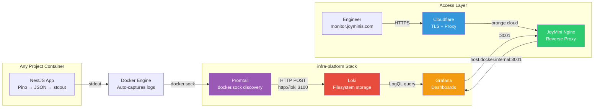

# infra-platform — Centralized Log Infrastructure

[](https://grafana.com/oss/loki/)
[](https://grafana.com/)
[](LICENSE)
[](https://github.com/MrBigPorter/hyperpush)

> **A multi-project Docker log aggregation stack.** Collects, stores, and visualizes container logs from **all projects on a single VPS** — HyperPush, JoyMini, CodePush, and more — through a unified Grafana dashboard at `monitor.joyminis.com`.

---

## Architecture at a Glance



## Status

| Project | Status | Domain |
|---------|--------|--------|
| **infra-platform** (this) | ✅ Deployed | [monitor.joyminis.com](https://monitor.joyminis.com) |
| **HyperPush** | 🟢 Live | [hyperpush.org](https://hyperpush.org) / [cp.hyperpush.org](https://cp.hyperpush.org) |
| **JoyMini** | 🟢 Live | [joyminis.com](https://joyminis.com) |

## Key Features

| Capability | How |
|------------|------|
| **Zero-config per service** | Promtail auto-discovers all containers via `docker.sock` |
| **Cost-effective storage** | Loki compresses logs into chunks on local filesystem (not a DB) |
| **10-day retention** | Configurable, balanced between cost and debugging needs |
| **Multi-project visibility** | All containers tagged by `compose_project`, `service`, `container` |
| **Production-grade access** | Cloudflare (orange cloud) + JoyMini Nginx reverse proxy |
| **Auto-provisioned dashboard** | HyperPush dashboard loaded automatically in Grafana |

## Quick Start

```bash
# Start the monitoring stack
make up

# Check container status
make ps

# Tail all logs
make logs

# Stop the stack
make down

# Open Grafana
open http://localhost:3001   # admin / admin
```

Run `make help` to see all available commands.

## Quick Links

| Document | What You'll Learn |
|----------|-------------------|
| [Architecture Deep Dive](docs/architecture.md) | Component design, network topology, scalability |
| [Data Flow: From Pino to Dashboard](docs/data-flow.md) | End-to-end trace of a single log line |
| [Technology Decisions](docs/tech-decisions.md) | Why Loki? Why Promtail? Why filesystem? |
| [Production Deployment](docs/deployment.md) | Cloudflare + Nginx + monitoring stack setup |
| [LogQL Query Reference](docs/log-queries.md) | Query patterns for debugging |
| [Operations Guide](docs/operations.md) | Maintenance, troubleshooting, disk management |

## Related Projects

| Project | Description | Docs |
|---------|-------------|------|
| [HyperPush](https://github.com/MrBigPorter/hyperpush) | NestJS BFF + CodePush management console | [Logging Integration](https://github.com/MrBigPorter/hyperpush/blob/main/docs/deployment.md) |
| JoyMini Nest Monorepo | NestJS microservices with Nginx reverse proxy | — |

## Tech Stack

| Component | Role | Image |
|-----------|------|-------|
| **Loki** | Log storage, indexing, compression | `grafana/loki:latest` |
| **Promtail** | Log collection, Docker service discovery | `grafana/promtail:latest` |
| **Grafana** | Visualization, dashboards, alerting | `grafana/grafana:latest` |
| **JoyMini Nginx** | Reverse proxy, TLS termination | Custom (JoyMini project) |
| **Auth Service** | JWT token validation for Grafana SSO | `node:20-alpine` |
| **Cloudflare** | DNS, DDoS protection, TLS edge | External |

## Access

| Environment | URL | How to Start | Auth |
|-------------|-----|-------------|------|
| **Production** | [https://monitor.joyminis.com](https://monitor.joyminis.com) | Deployed on VPS | `admin` / configurable via `GRAFANA_ADMIN_PASSWORD` |
| **Test / Local** | [http://localhost:3001](http://localhost:3001) | `make up` on dev machine | `admin` / `admin` |
