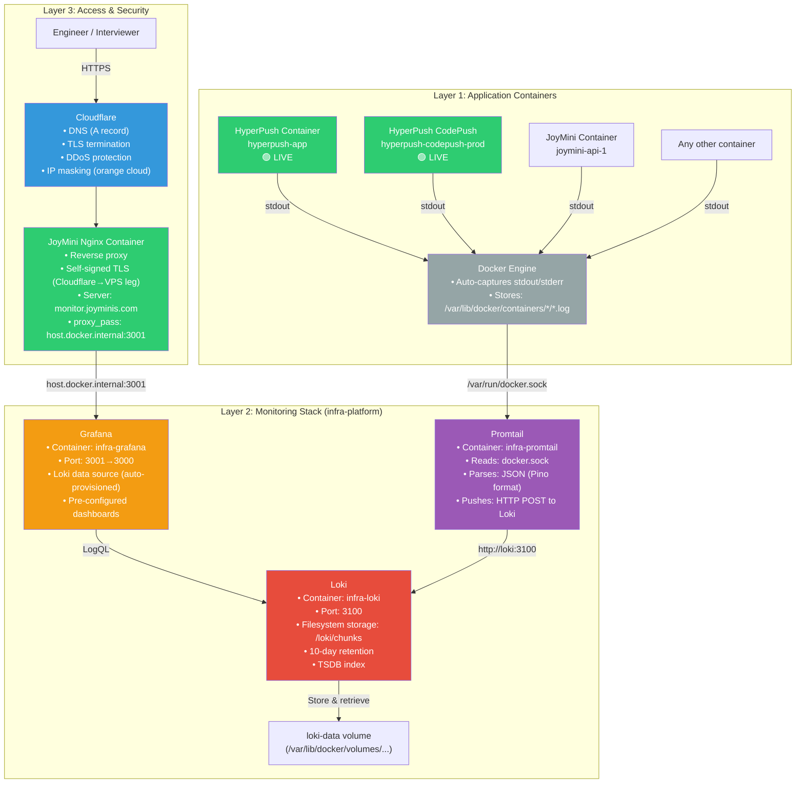

# 🏛️ System Architecture

> A deep dive into how infra-platform is designed — component responsibilities, network topology, and scalability considerations.

---

## Architecture Overview



**Live status:** HyperPush is now deployed to production on the same VPS. Its containers (`hyperpush-app`, `hyperpush-codepush-prod`, `hyperpush-db`, etc.) are auto-discovered by Promtail — **no additional configuration required.**

---

## Layer 1: Application Containers (Data Sources)

Any Docker container on the host automatically becomes a log source — no agent installation, no sidecar, no configuration per project.

**How it works:**
1. Applications write logs to **stdout** (Pino in NestJS, or any framework)
2. Docker Engine **automatically** captures stdout/stderr to JSON files on disk
3. Promtail discovers these containers via the Docker API socket

**Supported projects:**
- [HyperPush](https://github.com/MrBigPorter/hyperpush) — NestJS BFF, JSON logs via Pino **(🟢 live in production)**
- JoyMini Nest Monorepo — Multiple NestJS apps in a monorepo
- CodePush Server — Node.js REST server **(🟢 live in production, as part of HyperPush)**
- Any future containerized service — zero configuration required

---

## Layer 2: Monitoring Stack (Core)

Three containers running in the `infra-platform` Docker Compose project:

### Promtail — Log Collector

| Property | Value |
|----------|-------|
| Image | `grafana/promtail:latest` |
| Network | `infra-platform_monitoring` (bridge) |
| Key Mount | `/var/run/docker.sock:/var/run/docker.sock:ro` |
| Config | [`promtail-config.yml`](../promtail-config.yml) |

Promtail acts as the **bridge between Docker and Loki**. It:
- Discovers all running containers via the Docker API
- Reads their stdout logs
- Parses JSON-formatted logs (Pino output) to extract structured fields
- Labels each log line with `container`, `service`, `compose_project`
- Pushes to Loki via HTTP

### Loki — Log Storage & Index

| Property | Value |
|----------|-------|
| Image | `grafana/loki:latest` |
| Port | `3100` (Docker network only) |
| Storage | Local filesystem at `/loki/chunks` |
| Index | TSDB (v13 schema) |
| Retention | 240h (10 days) |
| Config | [`loki-config.yml`](../loki-config.yml) |

Loki stores logs as **compressed chunks** on disk. Unlike Elasticsearch, it does not index the log content — only labels (container name, service name, log level). This makes storage extremely efficient.

### Grafana — Visualization

| Property | Value |
|----------|-------|
| Image | `grafana/grafana:latest` |
| Host Port | `3001` → container port `3000` |
| Provisioning | Auto-configured via files in `./grafana-provisioning/` |
| Config | [`compose.monitoring.yml`](../compose.monitoring.yml) |

Grafana is pre-configured with:
- Loki as the default data source (auto-provisioned via [`grafana-provisioning/datasources/loki.yml`](../grafana-provisioning/datasources/loki.yml))
- Dashboard provisioning (via [`grafana-provisioning/dashboards/`](../grafana-provisioning/dashboards/))

---

## Layer 3: Access & Security

### JoyMini Nginx Reverse Proxy

The monitoring stack is exposed via the existing JoyMini Nginx container (`lucky-nginx-prod`):

```
Configuration: nginx/conf.d/50-monitor.conf
Server name:   monitor.joyminis.com
Upstream:      http://host.docker.internal:3001
```

**Why `host.docker.internal`?** The monitoring stack and JoyMini Nginx are in different Docker Compose projects. `host.docker.internal` resolves to the Docker host, allowing cross-compose communication.

### Cloudflare

```
Record:   A record monitor.joyminis.com → <VPS_IP>
Proxy:    🟠 Proxied (orange cloud) — hides real IP, provides TLS
Mode:     Full — Cloudflare terminates TLS, re-encrypts to VPS
```

---

## Network Topology

```
┌─────────────────────────────────────────────────────┐
│                   VPS (<VPS_IP>)                     │
│                                                       │
│  ┌──────────────────────────────────────┐            │
│  │  JoyMini Nginx Container              │            │
│  │  Ports: 80, 443 (host)                │            │
│  │  Config: 50-monitor.conf              │            │
│  │  Upstream: host.docker.internal:3001   │            │
│  └────────────┬─────────────────────────┘            │
│               │ host.docker.internal                  │
│               │                                       │
│  ┌────────────▼────────────────────────┐             │
│  │  infra-platform Monitoring Stack     │             │
│  │                                      │             │
│  │  ┌─────────┐  ┌─────────┐  ┌──────┐ │             │
│  │  │ Promtail │  │  Loki   │  │Grafana│ │             │
│  │  │  (no    │──▶│ :3100   │◀─│:3001 │ │             │
│  │  │  ports)  │  │         │  │→:3000│ │             │
│  │  └────┬────┘  └─────────┘  └──────┘ │             │
│  │       │ Docker bridge network        │             │
│  └───────┼─────────────────────────────┘             │
│          │ docker.sock                                │
│  ┌───────▼─────────────────────────────────────┐     │
│  │  Other Containers (hyperpush, joymini, ...)  │     │
│  │  stdout → Docker auto-captures              │     │
│  └─────────────────────────────────────────────┘     │
└─────────────────────────────────────────────────────┘
```

---

## Port Allocation (No Conflicts)

| Service | Host Port | Project |
|---------|-----------|---------|
| Grafana | `3001` | infra-platform |
| Loki | `3100` | infra-platform |
| Auth Service | `3004` | infra-platform |
| HyperPush App | `3002` | HyperPush |
| HyperPush DB | `5433` | HyperPush |
| JoyMini Nginx | `80, 443` | JoyMini |

All ports are confirmed non-conflicting with existing production services.

---

## Design Principles

1. **Zero-config per service** — Add a new container, logs appear automatically
2. **Separation of concerns** — Monitoring stack is independent from application stacks
3. **Cost efficiency** — Loki's filesystem chunks are ~10x cheaper than Elasticsearch
4. **Single point of access** — All logs through one Grafana instance, one domain
5. **Production security** — Cloudflare + self-signed TLS for encrypted transport
