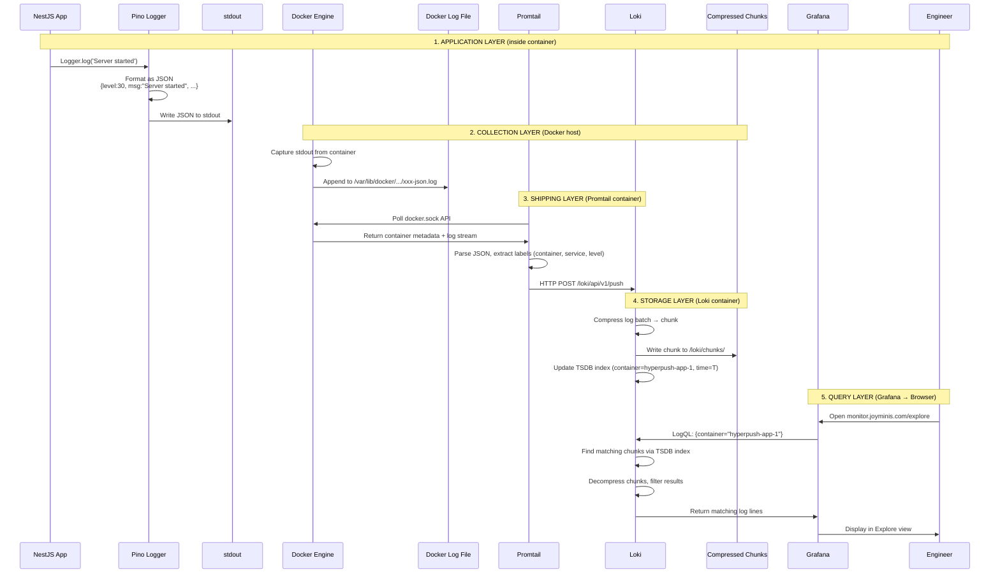

# 📡 Data Flow: From Pino to Dashboard

> Follow a single log line from its origin in a NestJS application through Docker, Promtail, and Loki, until it appears in a Grafana dashboard.

---

## The Complete Pipeline



---

## Step-by-Step Trace

### Step 1: Pino Outputs JSON to stdout

**File**: [`backend/src/main.ts`](https://github.com/MrBigPorter/hyperpush/blob/main/backend/src/main.ts#L9-L10)

```typescript
const app = await NestFactory.create(AppModule, { bufferLogs: true });
app.useLogger(app.get(Logger));
```

**File**: [`backend/src/app.module.ts`](https://github.com/MrBigPorter/hyperpush/blob/main/backend/src/app.module.ts#L24-L38)

```typescript
LoggerModule.forRoot({
  pinoHttp: {
    // In production (transport: undefined), Pino outputs raw JSON
    transport: process.env.NODE_ENV !== 'production'
      ? { target: 'pino-pretty' }
      : undefined,
    redact: {
      paths: ['req.headers.authorization', 'body.password'],
      censor: '[REDACTED]',
    },
  },
}),
```

**What Pino writes to stdout:**
```json
{"level":30,"time":1712345678000,"pid":8,"hostname":"e1b9ff777f49","context":"NestApplication","msg":"Nest application successfully started"}
```

Each field:
| Field | Meaning | Used in Loki as |
|-------|---------|-----------------|
| `level` | Severity (30=info, 40=warn, 50=error) | Label `level` |
| `time` | Unix timestamp in milliseconds | Timestamp |
| `msg` | Human-readable message | Searchable content |
| `context` | NestJS module/class name | Searchable content |
| `pid` | Process ID | Metadata |
| `hostname` | Container hostname | Metadata |

### Step 2: Docker Captures stdout

Docker Engine **automatically** captures everything written to stdout and stderr by any container — no configuration needed.

**Storage location on the host:**
```
/var/lib/docker/containers/<container-id>/<container-id>-json.log
```

Docker wraps each log line with metadata:
```json
{"log":"{\"level\":30,\"msg\":\"Server started\"}\n","stream":"stdout","time":"2026-06-05T04:50:22.545Z"}
```

### Step 3: Promtail Discovers and Ships

**File**: [`promtail-config.yml`](../promtail-config.yml)

```yaml
# Discover all containers on the host
docker_sd_configs:
  - host: unix:///var/run/docker.sock

# Label each log line with container metadata
relabel_configs:
  - source_labels: [__meta_docker_container_name]
    target_label: container
  - source_labels: [__meta_docker_compose_project]
    target_label: compose_project
  - source_labels: [__meta_docker_compose_service]
    target_label: service

# Parse Pino JSON to extract structured fields
pipeline_stages:
  - json:
      expressions:
        level: level
        msg: msg
        requestId: requestId
        context: context
  - labels:
      level: level
```

**The `docker.sock` magic**: Promtail mounts `/var/run/docker.sock` from the host. This Unix socket gives Promtail access to the Docker API — it can list all running containers, read their logs, and monitor for new containers — **regardless of which Docker Compose project they belong to**.

**Why this is powerful:**
- No per-service configuration
- Auto-discovers new containers
- Works across different compose projects (HyperPush, JoyMini, CodePush, etc.)

### Step 4: Loki Compresses and Stores

**File**: [`loki-config.yml`](../loki-config.yml)

```yaml
storage:
  filesystem:
    chunks_directory: /loki/chunks    # Compressed log data
    rules_directory: /loki/rules      # Alerting rules

schema_config:
  configs:
    - store: tsdb                     # TSDB for label index only
      object_store: filesystem        # Log content on filesystem
      schema: v13

limits_config:
  retention_period: 240h              # 10 days
```

**Loki does NOT store logs like a traditional database:**

| Aspect | Traditional DB (PostgreSQL) | **Loki** |
|--------|---------------------------|----------|
| Storage unit | Row in a table | **Compressed chunk** (multiple log lines in one gzip file) |
| Index | B-tree on arbitrary columns | **TSDB** — only on labels (container, service, level) |
| Write | INSERT per row | **Batch append** to current chunk |
| Compression ratio | ~1:1 | **~5:1 to 20:1** (gzip on repeated text) |
| Cost per GB | High (index is expensive) | **Very low** |

### Step 5: Grafana Queries and Displays

**File**: [`grafana-provisioning/datasources/loki.yml`](../grafana-provisioning/datasources/loki.yml)

```yaml
datasources:
  - name: Loki
    type: loki
    url: http://loki:3100           # Docker network DNS resolution
    isDefault: true
```

Grafana connects to Loki **by container name** (`loki:3100`) within the shared Docker bridge network. No hardcoded IP addresses.

**The query flow:**
1. User opens `https://monitor.joyminis.com/explore`
2. Grafana sends a LogQL query to `http://loki:3100`
3. Loki looks up the TSDB index to find matching chunks
4. Loki decompresses and returns matching log lines
5. Grafana renders them in the Explore view

---

## Key Takeaways

1. **The application knows nothing about Loki** — it just writes JSON to stdout
2. **Promtail is the bridge** — it translates Docker logs into Loki pushes
3. **Loki is optimized for cost** — labels only, content compressed
4. **Docker socket enables cross-project discovery** — one Promtail serves all containers
5. **The entire pipeline is 3 containers** — minimal resource overhead
