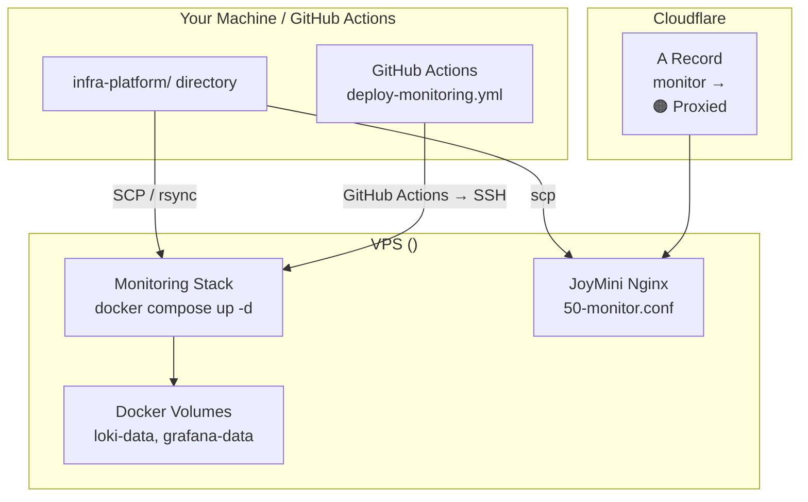

# 🚀 Production Deployment

> How the monitoring stack is deployed to production — from VPS provisioning to Cloudflare DNS configuration.

---

## Deployment Architecture



Two deployment methods are supported:
- **🔁 CI/CD (recommended):** GitHub Actions workflow — push to main triggers auto-deploy
- **🖥️ Manual:** SCP files + SSH commands for one-time setup

---

## Prerequisites

- Docker 24+ and Docker Compose 2.x installed on VPS
- SSH access to VPS (with key-based authentication)
- `infra-platform/` directory on local machine
- JoyMini Nginx running on VPS (see [JoyMini Deployment](https://github.com/MrBigPorter/JoyMini_Nest_Monorepo))
- HyperPush project deployed on the same VPS (see [HyperPush Deployment](https://github.com/MrBigPorter/hyperpush))

---

## Method 1: CI/CD Deployment (Recommended)

### GitHub Actions Workflow

A workflow file `.github/workflows/deploy-monitoring.yml` handles deployment automatically:

```yaml
# Simplified flow:
# 1. Checkout infra-platform code
# 2. SCP config files to VPS /opt/infra-platform/
# 3. SSH: docker compose up -d
# 4. Health check
```

### Required GitHub Secrets

| Secret | Description | Source |
|--------|-------------|--------|
| `SSH_HOST` | VPS IP address | Same as HyperPush |
| `SSH_PORT` | SSH port (default: 22) | Same as HyperPush |
| `SSH_USERNAME` | SSH user | Same as HyperPush |
| `SSH_PRIVATE_KEY` | SSH private key | Same as HyperPush |
| `GRAFANA_ADMIN_PASSWORD` | Grafana admin password | Generate secure password |
| `GRAFANA_AUTH_SECRET` | JWT signing secret | **Must match HyperPush `.env`!** |

Generate the auth secret:
```bash
openssl rand -hex 32
```

### Triggering Deployment

1. Push to `main` branch → auto-triggers if config files changed
2. Or manually: GitHub → Actions → Deploy Monitoring → Run workflow

---

## Method 2: Manual Deployment (One-Time Setup)

### Step 1: Sync Files to VPS

```bash
# From your local machine
scp -r ../infra-platform user@<VPS_IP>:/home/user/infra-platform/
```

Or use rsync for incremental updates:

```bash
rsync -avz --delete ../infra-platform/ user@<VPS_IP>:/home/user/infra-platform/
```

### Step 2: Sync Nginx Config to JoyMini

```bash
# Copy the monitor domain config to JoyMini's nginx conf.d
scp ../JoyMini_Nest_Monorepo/nginx/conf.d/50-monitor.conf \
    user@<VPS_IP>:/home/user/JoyMini_Nest_Monorepo/nginx/conf.d/50-monitor.conf
```

**Nginx config summary** ([`50-monitor.conf`](https://github.com/MrBigPorter/JoyMini_Nest_Monorepo/blob/main/nginx/conf.d/50-monitor.conf)):

```nginx
server {
    listen 443 ssl http2;
    server_name monitor.joyminins.com;

    ssl_certificate     /etc/nginx/certs/server.crt;
    ssl_certificate_key /etc/nginx/certs/server.key;

    location / {
        proxy_pass http://host.docker.internal:3001;
        proxy_set_header Host $host;
        proxy_set_header X-Real-IP $remote_addr;
        proxy_set_header X-Forwarded-Proto $scheme;
    }
}

# HTTP → HTTPS redirect
server {
    listen 80;
    server_name monitor.joyminins.com;
    return 301 https://$host$request_uri;
}
```

**Key details:**
- Uses self-signed certs (same as other JoyMini domains)
- Proxies to Grafana via `host.docker.internal:3001`
- HTTP to HTTPS redirect included
- Security probe blocking (`.env`, `.git` paths return 444)

### Step 3: Start the Monitoring Stack

```bash
# SSH into VPS
ssh user@<VPS_IP>

# Navigate to infra-platform
cd /home/user/infra-platform

# Start all services
docker compose -f compose.monitoring.yml up -d

# Verify all 4 containers are running
docker compose -f compose.monitoring.yml ps

# Expected output:
# NAME              IMAGE                   STATUS         PORTS
# infra-loki        grafana/loki:latest     Up             0.0.0.0:3100->3100/tcp
# infra-promtail    grafana/promtail:latest Up
# infra-grafana     grafana/grafana:latest  Up             0.0.0.0:3001->3000/tcp
# infra-auth        node:20-alpine          Up             0.0.0.0:3004->3002/tcp
```

### Step 4: Restart JoyMini Nginx

```bash
# Navigate to JoyMini deployment directory
cd /home/user/JoyMini_Nest_Monorepo

# Reload nginx configuration (no downtime)
docker compose -f compose.prod.yml exec nginx nginx -s reload
# OR restart the container
docker compose -f compose.prod.yml restart nginx

# Verify the config is loaded
docker compose -f compose.prod.yml exec nginx nginx -T | grep monitor
# Should output: server_name monitor.joyminins.com;
```

### Step 5: Configure Cloudflare DNS

| Field | Value |
|-------|-------|
| Type | `A` |
| Name | `monitor` |
| IPv4 | `<VPS_IP>` |
| Proxy status | 🟠 **Proxied** (orange cloud) |
| SSL/TLS mode | **Full** |

> **Why orange cloud?** Gray cloud (DNS only) exposes the real VPS IP. Orange cloud hides the IP behind Cloudflare and provides TLS termination.

> **Why Full (not Flexible)?** Our VPS Nginx uses a self-signed certificate. "Full" means Cloudflare still requires TLS from the origin, while "Flexible" would allow HTTP from Cloudflare → VPS. Both work—"Full" ensures the traffic is always encrypted between Cloudflare and VPS.

### Step 6: Verify

```bash
# Check DNS propagation
dig monitor.joyminins.com

# Check HTTPS access (should return Grafana login page)
curl -I https://monitor.joyminins.com

# Open in browser
open https://monitor.joyminins.com
```

**Expected result:** Grafana login page at `https://monitor.joyminins.com` with valid HTTPS certificate from Cloudflare.

### Step 7: Initialize Grafana

1. Open `https://monitor.joyminins.com`
2. Login with default credentials: `admin` / `admin` (or your `GRAFANA_ADMIN_PASSWORD`)
3. **Change the admin password immediately**
4. Set `GRAFANA_ADMIN_PASSWORD` environment variable in `compose.monitoring.yml`
5. Navigate to **Explore** (`/explore`) — Loki data source should already be configured
6. Check the **HyperPush** dashboard is auto-loaded in Dashboards section

---

## Environment Variables

| Variable | Default | Description |
|----------|---------|-------------|
| `GRAFANA_ADMIN_PASSWORD` | `admin` | Grafana admin password (change in production!) |
| `GRAFANA_AUTH_SECRET` | — | **Required for SSO.** Shared secret between HyperPush backend and auth-service for JWT token signing/validation. Generate with `openssl rand -hex 32` |

These can be set in a `.env` file alongside `compose.monitoring.yml`:

```bash
# ../infra-platform/.env
GRAFANA_ADMIN_PASSWORD=your-secure-password
GRAFANA_AUTH_SECRET=your-random-64-char-hex-string
```

---

## Verification Checklist

- [ ] `docker compose -f compose.monitoring.yml ps` shows all 4 containers `Up`
- [ ] `curl http://localhost:3001` returns Grafana HTML
- [ ] `curl -I https://monitor.joyminins.com` returns `200 OK` with Grafana headers
- [ ] Grafana Explore shows Loki data source with auto-complete
- [ ] `{compose_project="hyperpush"}` returns logs from HyperPush containers
- [ ] `{container="hyperpush-app"}` returns logs from the main HyperPush app
- [ ] `{compose_project="joymini"}` returns logs from JoyMini containers
- [ ] HyperPush dashboard is visible in Grafana Dashboards
